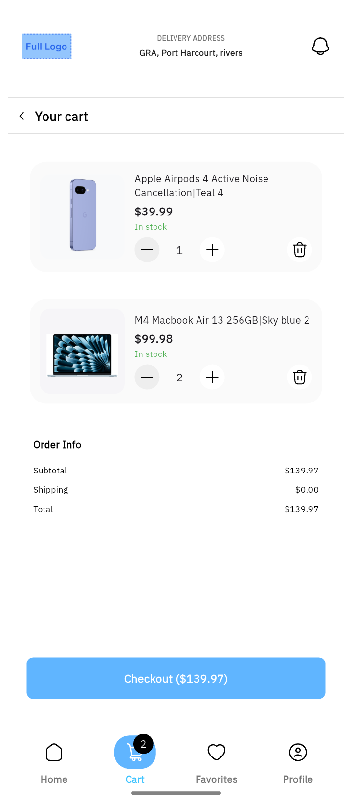
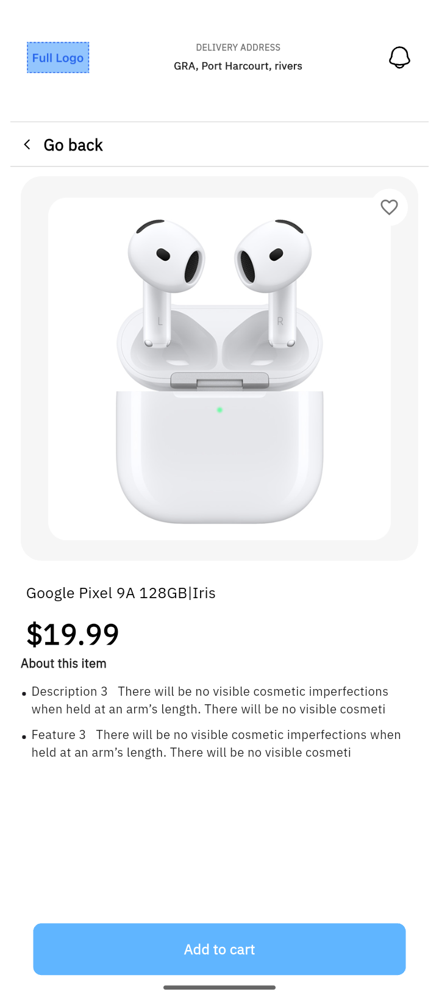
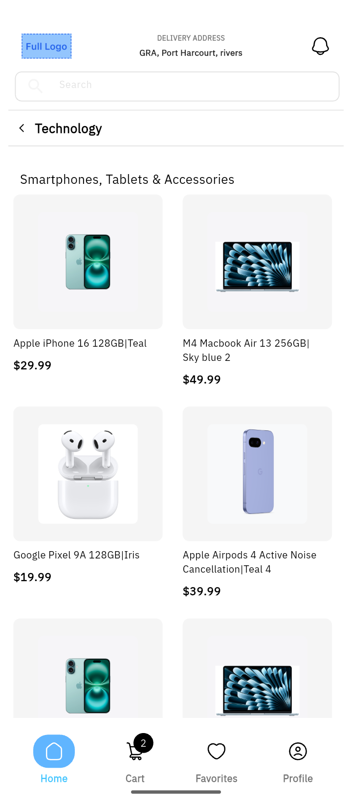

# 📱 MiniMart App

**A modern e-commerce app** —  with MiniMart you can buy your favorite items!

---

## 🛠️ Technology Stack

| Layer             | Technology        |
|------------------|------------------|
| Frontend          | Flutter (Dart)   |
| State Management  | Riverpod        |
| Navigation        | Go Router
| Backend           | —                |
| Database          | —                |
| Authentication    | —                |
| Storage           | —                |

---

## 🧠 Architecture

The Dantown App follows a **Feature driven** architectural pattern. Each feature carries a model, view, state and common folder:

- **Model**: Represents the data in each feature.
- **View**:  Represents the UI logic in each feature.
- **State**:  Holds the State logic in each feature bridging the view and any data source the app might incoporate in future.
**Common**: Holds helpers widgets along with other utilities that may be shared within that feature 

---

## 📁 Screenshots
 

### Cart Screen

### Details Screen

### Details Screen

---

## 🛠️ Setup Instructions

To run this code on your device ensure you are running with the following Flutter and Java versions:

    - Flutter version 3.29.2
    - Java version 17

then, 
   1. Clone the github repository
   2. Run 'flutter pub get' to get dependencies.
   3. Run the app.
